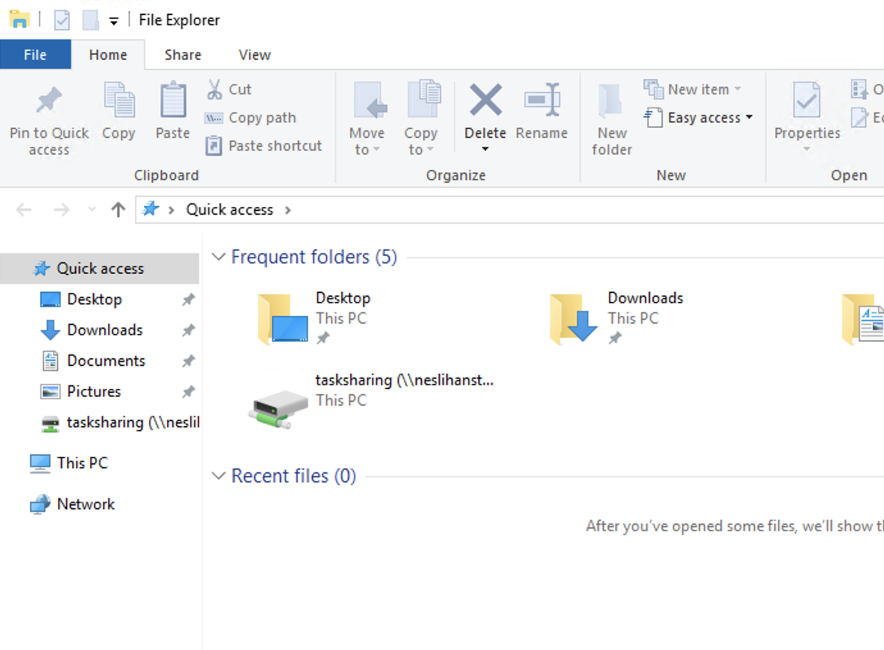
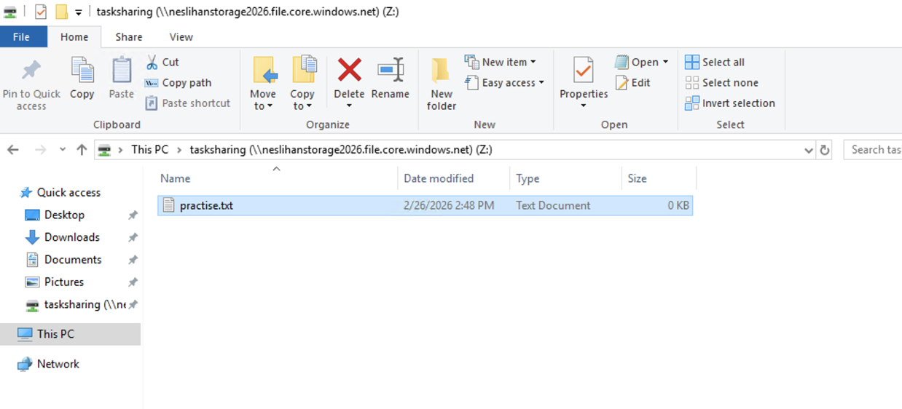
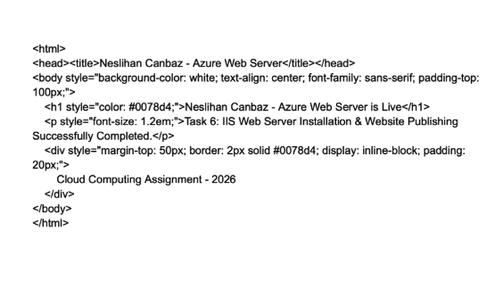
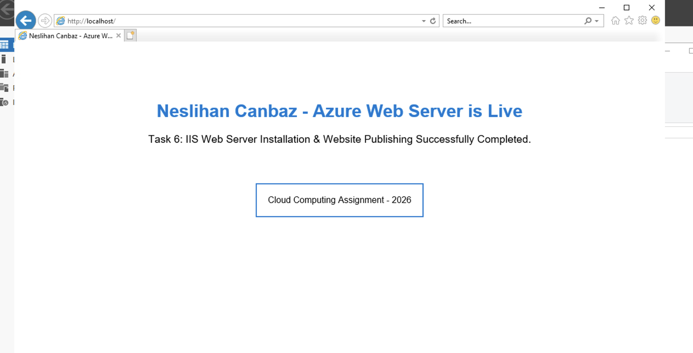
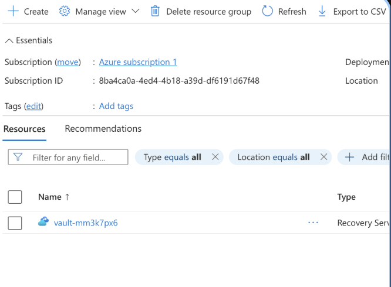

Technical Project: Azure Cloud Infrastructure & Web Deployment
Student: Neslihan Canbaz
Date: February 26, 2026
Project Scope: Virtual Machine Deployment, Cloud Storage Integration, and Web Server Configuration.

1. Virtual Machine Configuration
The foundation of this project was the deployment of a Windows Server 2022 Datacenter virtual machine on Microsoft Azure. I established secure access via Remote Desktop Protocol (RDP) to initialize the system management environment.

Figure 1: Successful RDP session dashboard showing the active Windows Server desktop.

2. Azure File Share & Cloud Storage Integration
To standardize data management across cloud resources, I engineered a high-scalability storage solution.
Storage Account: Created under the name neslihanstorage2026.
Implementation: Mounted the tasksharing file share as a persistent Z: Drive using a PowerShell connection script.
Verification: Integration was confirmed through File Explorer, and data integrity was verified with a test file named practise.txt.

Figure 2: Tasksharing file share successfully mapped as a network drive.

Figure 3: Verification of the test file inside the Z: drive

3. Web Server & Site Publishing
I transformed the virtual machine into an active web server to host a custom project summary.
IIS Installation: Installed Internet Information Services (IIS) to handle web requests.
Custom Deployment: I modified the server's root directory and updated the HTML code to display a personalized landing page.
Customized HTML Structure: The personalized content was achieved by modifying the iisstart.htm file with the following structure:

Figure 4: The live, customized project landing page served by the IIS web server.

Web Page Content:
Header: Neslihan Canbaz - Azure Web Server.
Status Message: Task 6: IIS Web Server Installation & Website Publishing Successfully Completed.

Figure 5: The live, customized project landing page served by the IIS web server.

4. Challenges & Technical Troubleshooting
The most valuable part of this project was navigating through unexpected technical hurdles.
Case 1: HTML vs. Image Encoding
During the website customization, I accidentally attempted to edit the iisstart.png file using a text editor instead of the iisstart.htm file. This caused broken image links and encoding warnings. I resolved this by correctly identifying the HTML source file and reapplying the proper code.
Case 2: The "Recovery Services Vault" Deletion Deadlock
The final cleanup phase presented a significant challenge. While attempting to delete the Resource Group, I encountered a persistent error caused by the Recovery Services Vault.
The Problem: The vault refused to be deleted because it contained active backup items and protected infrastructure dependencies.

Figure 6: Azure Resource Group overview highlighting the Recovery Services Vault (vault-mm3k7px6) which caused a deletion deadlock due to its internal backup dependencies, requiring a manual cleanup process.
The Process: I spent a considerable amount of time manually attempting to delete the Resource Group, but Azure's protection policies blocked the action.
The Solution: By following Azure's diagnostic prompts, I navigated to the "Backup Items" and "Infrastructure" sections within the vault. I manually stopped the backup protection, deleted the retained data, and finally uninstalled the links. Once the vault was empty, I was able to successfully delete the entire Resource Group.

5. Conclusion
This project reinforced the importance of not only building cloud infrastructure but also managing the "Lifecycle Management" and dependency issues within a cloud environment. Successfully troubleshooting the vault deletion provided deep insights into Azure's security and resource cleanup protocols.

